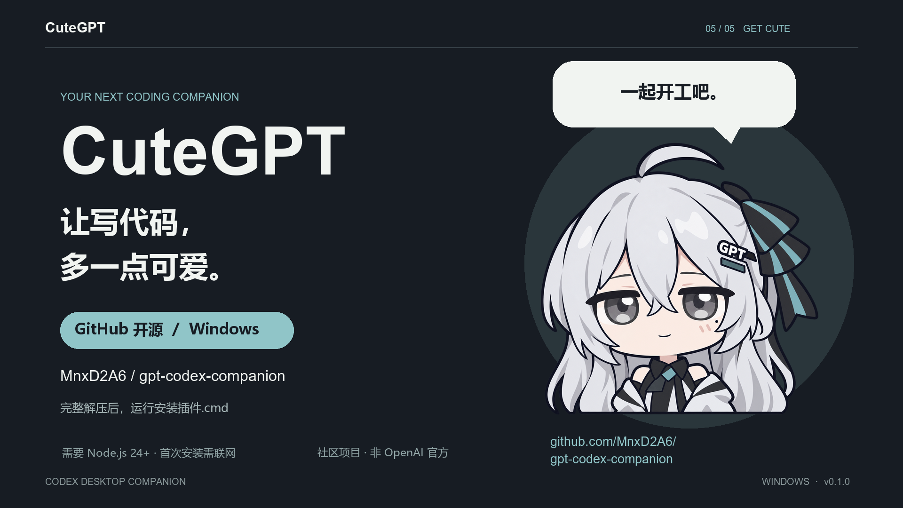

# CuteGPT · Codex 额度挂件（W-15）

Windows Codex 桌面挂件，默认显示 5 小时／周订阅额度快照、剩余百分比、重置时间与快照更新时间。银发 CuteGPT 采用原小鲸鱼的 Q 版半身画风，支持拖动、吸附、按压回弹、角色气泡、声音和自定义素材。

这是社区项目，非 OpenAI 官方插件。

## 30 秒认识 CuteGPT

[](https://github.com/MnxD2A6/gpt-codex-companion/releases/download/v0.1.0/CuteGPT_promo_1080p.mp4)

[观看／下载宣传视频（30 秒 · 1080p · 16:9）](https://github.com/MnxD2A6/gpt-codex-companion/releases/download/v0.1.0/CuteGPT_promo_1080p.mp4) · [下载 Windows 插件包](https://github.com/MnxD2A6/gpt-codex-companion/releases/tag/v0.1.0)

[在 B站观看 CuteGPT 演示](https://www.bilibili.com/video/BV1vsHL6oEco/)

视频展示角色、订阅额度快照、本地梗台词与自动跟随。片中额度为示例数据，窗口为功能示意动画。

基于 [MeteorNOX/DeepSeek-Balance-Whale-Widget](https://github.com/MeteorNOX/DeepSeek-Balance-Whale-Widget) 的 For-Codex 分支，Codex 适配原作者 Yang-huai406；保留 [macOS PR #128](https://github.com/MeteorNOX/DeepSeek-Balance-Whale-Widget/pull/128) 来源。W-15 0.1.0 首版验证范围为 Windows x64。

## 安装

推荐下载 [Windows x64 简易安装包](https://github.com/MnxD2A6/gpt-codex-companion/releases/download/v0.1.0/CuteGPT-0.1.0-quick-install-windows-x64.zip)，无需手动安装 Node.js；需要已安装支持插件功能的 Codex 桌面应用。首次安装仍需联网下载 Electron 44.3.0。

1. 将 ZIP 完整解压到普通文件夹，不要在压缩包内直接运行。
2. 双击 `安装CuteGPT.cmd`，保持网络连接并等待安装完成。
3. 安装完成后新建 Codex 聊天，加载 `gpt_quota`、`gpt_open` 等工具。

简易包附带经官方 SHA-256 校验的 Node.js 24.19.0，安装到当前用户的 `LocalAppData/CuteGPT`，只供插件使用，不修改系统 PATH。使用期间请保留该运行时目录；Node 及其依赖许可随包保留。

如果已安装 Node.js 24+（含 npm），也可继续使用原 `gpt-codex-companion-0.1.0-windows.zip`，解压后双击 `安装插件.cmd`。两种包都沿用同一插件安装器，都不是离线 EXE。

原插件包可先执行只读预检：
```powershell
powershell.exe -NoProfile -ExecutionPolicy Bypass -File .\scripts\install-package.ps1 -CheckOnly
```
完整安装使用同一命令去掉 `-CheckOnly`。安装器备份本插件旧版本并保存私有回滚回执。默认插件标识 `gpt-codex-companion`、任务名 `Codex GPT Companion`，与原小鲸鱼分别安装。

## 使用

- 点击角色：随机说一句 CuteGPT 台词；开启后，开场自动冒泡，之后每 30–70 秒随机说话，约 6.5 秒收起。
- 查看额度：菜单中的“概览”或“查看订阅额度”；关闭随机说话后，点击角色仍可查看额度卡片。
- 编辑台词：设置中的“音效、提示与手感”，每行一句，也可关闭随机说话。内置 60 条玩笑台词，包含“傻子Tibo”“给我买充值卡”“你怎么来了”，以及 GPT、DeepSeek、Claude、Gemini、Grok、Copilot、Cursor 和 AI 画图等梗。台词本地随机播放，不调用模型。
- 右键角色或悬停后的菜单按钮：进入概览／用量／设置。
- 设置：角色大小、吸附、气泡、声音、素材管理；保存生效，取消放弃草稿。
- 托盘：恢复显示、切换独立桌面／跟随 Codex、退出。
- Windows Ctrl+Alt+G：恢复显示；Ctrl+Alt+Shift+G：保存本地诊断。
- `进入独立桌面.cmd`：独立显示，最小化 Codex 后仍保留；切回跟随 Codex 恢复窗口跟随。

额度来自本机日志的官方快照。缺失显示“未观测”，过期显示“快照已过期”；到达重置时间后需要新的快照确认额度。本机 token 统计不等于官方订阅配额，不能换算准确剩余 token。API 余额是可选模式，与订阅额度分别展示。

## 停止与回滚

`停止挂件服务.cmd` 停止显示服务；`停用自动跟随.cmd` 停用本插件自启。`回滚本次安装.cmd` 根据私有安装回执恢复本插件此前状态，保留本插件最新设置与素材。没有回执时不会猜测旧备份。

数据默认保存于 `$CODEX_HOME/gpt-codex-companion`，无 CODEX_HOME 时为用户目录下 `.codex/gpt-codex-companion`。可通过 `GPT_WIDGET_HOME` 指定独立目录。请勿公开该目录内的 runtime.json、安装回执、凭据或诊断内容。

## 验证与来源

当前测试与实机范围见 [W-15 验证记录](docs/W15_VERIFICATION.md)。上游历史结果不代替本版本验证，macOS 尚未实机验收。

代码沿用 MIT，保留 [LICENSE](LICENSE) 和 [第三方说明](THIRD_PARTY_NOTICES.md)。R01 角色由内置 image_gen 按用户角色特征参考与上游画风参考生成，经用户确认；R02 按用户反馈修改直视眼神，经用户确认后按要求接入左右镜像版。原媒体素材保留来源与原分发条款；不将原媒体重新声明为 W-15 原创。
